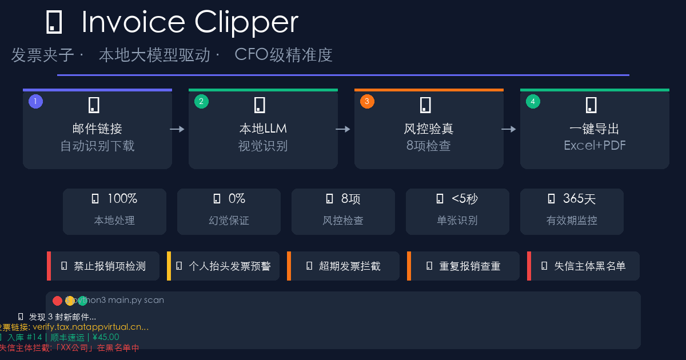

# 🧾 发票夹子 Invoice Clipper

<p align="center">
  <a href="https://github.com/Alan5168/invoice-clipper/actions/workflows/ci.yml">
    
  </a>
  
  
  
  
</p>

<h2 align="center">
  自动扫描邮箱 · 本地大模型识别 · 一键导出报销 Excel + 合并 PDF<br>
  <sub>支持税务查验 · 内控风控预警 · 发票真实性核验</sub>
</h2>

---

<p align="center">
  <a href="#-核心特性">核心特性</a> ·
  <a href="#-问题背景">问题背景</a> ·
  <a href="#-快速开始">快速开始</a> ·
  <a href="#-使用指南">使用指南</a> ·
  <a href="#-风控与验真">风控与验真</a> ·
  <a href="#架构">架构</a>
</p>

---



## ❓ 问题背景

财务报销中最费时的环节不是贴发票，而是：

| 环节 | 痛点 |
|------|------|
| 收票 | 邮箱里收到发票链接，要手动点开下载 |
| 整理 | PDF/OFD/图片混在一起，格式不统一 |
| 识别 | 手工录入易错，OCR 云服务有数据泄露风险 |
| 验真 | 发票真假、是否作废、是否超期，都要上税局网站查 |
| 报销 | 礼品卡/烟酒发票混进去，财务审完被打回 |

**发票夹子**解决以上全部。

---

## ✅ 核心特性

### 📥 智能收票
- **邮箱链接自动下载**：邮件正文里的发票链接（如国家税务总局查验平台）自动识别并下载附件，无需手动点开
- **附件扫描**：自动扫描邮箱 INBOX，发现 PDF/OFD 附件直接下载
- **目录监控**：配置监控文件夹，新发票放入后自动识别

### 🧠 本地大模型识别
- **四级降级识别链**：PDF文本 → 阿里百炼glm-5 → 本地glm-ocr → 本地qwen3-vl → PaddleOCR兜底
- **完全本地**：发票图片永不离开你的电脑，没有隐私泄露风险
- **OFD格式支持**：国内独有格式完整支持（含电子签章验签）

### 🚨 内控风控预警
入库即自动检查，发现问题发票**单独列清单**，不混入正常报销：

| 检查项 | 说明 |
|--------|------|
| 禁止报销项 | 礼品卡/烟酒/奢侈品，一经发现标记🚫 |
| 个人抬头发票 | 非差旅/交通/通讯场景提示⚠️ |
| 超期发票 | 超过365天自动预警 |
| 重复报销 | 发票号+金额双重查重 |
| 税务状态 | 作废/红冲/失控自动识别（需接入税局API）|
| 失信主体 | 税务局黑名单本地比对，销售方命中即拦截 |
| 大头小尾 | 票面金额异常检测 |
| 抬头错误 | 企业名称疑似错字提示 |

### 📊 一键导出
- **Excel报销明细**：标准化格式，按日期排序，可直接提交财务
- **合并PDF**：多张发票合并为一个文件，便于归档
- **问题发票清单**：单独红色Sheet标注，禁止报销项和警告项分开

---

## ⚡ 快速开始

### 环境要求
- Python 3.10+
- 推荐：Ollama（含 glm-ocr + qwen3-vl）
- 可选：无 Ollama 时自动降级到 PaddleOCR

### 零配置启动（推荐首次使用）

不想编辑 YAML？直接运行配置向导，回答几个问题即可完成配置：

```bash
# macOS/Linux
python3 setup_config.py

# Windows
setup.bat
```

向导会问你：
1. 📁 发票存放目录在哪？
2. 📧 要监控邮箱吗？（可选）
3. 🤖 用哪个识别引擎？（Ollama / 硅基流动 / PaddleOCR）
4. 🚨 启用失信黑名单吗？

回答完自动生成 `config/config.yaml`，无需手动编辑任何文件。

> 💡 **推荐使用硅基流动**：新用户注册送 **¥16 免费额度**，够用 1000+ 张发票。
> 👉 [点此注册（用我的邀请码）](https://account.siliconflow.cn/zh/login?redirect=https%3A%2F%2Fcloud.siliconflow.cn&invitation=wV34tYbt)

---

### 第一步：克隆项目

```bash
git clone https://github.com/Alan5168/invoice-clipper.git
cd invoice-clipper
```

### 第二步：安装依赖

```bash
# 核心依赖（必须有）
pip install -r requirements.txt

# 可选：本地 OCR（推荐安装，大幅提升识别率）
# 安装 Ollama: https://ollama.ai
ollama pull glm-ocr:latest
ollama pull qwen3-vl:latest

# 可选：PaddleOCR 兜底（无 Ollama 时自动启用）
pip install paddlepaddle paddleocr
```

### 第三步：配置

```bash
cp config/config.yaml.example config/config.yaml
# 用文本编辑器打开 config.yaml，填入以下关键项：
```

```yaml
# config/config.yaml
storage:
  base_dir: ~/Documents/发票夹子
  db_path: ~/Documents/发票夹子/invoices.db

ocr:
  ollama_base_url: http://127.0.0.1:11434
  ollama_glm_model: glm-ocr:latest
  ollama_qwen_model: qwen3-vl:latest
  # bailian_api_key: ${DASHSCOPE_API_KEY}  # 可选

email:
  enabled: true
  imap_server: imap.mail.me.com      # 你的 IMAP 服务器
  imap_port: 993
  username: your@email.com
  password: your-app-password         # 应用专用密码（非登录密码）
  folder: INBOX
  auto_follow_links: true             # ✅ 自动下载邮件正文中的发票链接
  trusted_link_domains:                # 只信任这些平台的链接
    - verify.tax
    - inv.verify

watch_dirs:
  - ~/Downloads
  - ~/Desktop/待处理发票

verification:
  validity_days: 365                 # 发票有效期（天）
```

### 第四步：运行

```bash
# 扫描邮箱和本地文件夹，处理新发票
python3 main.py scan

# 列出所有已入库发票
python3 main.py list

# 验真所有发票（税务状态+风控检查）
python3 main.py verify

# 查看问题发票清单
python3 main.py problems

# 导出报销（自动同时生成问题发票清单）
python3 main.py export --from 2026-03-01 --to 2026-03-31 --format both
```

---

## 📖 使用指南

### 命令总览

| 命令 | 说明 |
|------|------|
| `scan` | 扫描邮箱和监控目录，处理新发票 |
| `list` | 列出所有已入库发票 |
| `query --from X --to Y` | 按日期范围查询发票 |
| `verify [--days N]` | 批量验真（税务状态+风控），默认365天内有效 |
| `problems` | 查看问题发票清单（含禁止/警告原因）|
| `export --format both` | 导出报销Excel+合并PDF，自动附问题清单 |
| `exclude <ID>` | 手动标记发票为不可报销 |
| `include <ID>` | 恢复发票为可报销 |
| `process <file>` | 处理单个文件 |

### 发货票链接自动下载

这是中国特有的场景：许多公司通过税局平台推送电子发票，邮件里只有链接没有附件。

配置 `auto_follow_links: true` 后，发票夹子会：

1. 读取邮件正文
2. 识别 `verify.tax`、`inv.verify` 等信任域名下的链接
3. 自动下载并识别
4. **入库后立即验真**，有问题立刻标记

### OFD 电子发票处理

国内新版电子发票多为 OFD 格式（如数电票）。发票夹子：
- 自动转换为 PDF 进行识别
- 验证电子签章是否有效（未被篡改）
- 原始 OFD 文件归档保留

---

## 🚨 风控与验真

### 发票分级标准

```
🟢 正常   — 所有检查通过，可直接报销
🟡 警告   — 需要人工确认（如个人抬头发票）
🔴 禁止   — 不能报销（如礼品卡/超期/重复）
```

### 禁止报销项目

以下发票一经发现，标记为禁止报销，不允许混入报销单：
- 🎁 礼品、购物卡、储值卡
- 🍷 烟、酒（茅台/五粮液等）
- 👜 奢侈品（爱马仕/LV/Gucci等）
- 🏌️ 高尔夫、美容、SPA 等

### 超期说明

发票有效期默认365天（可配置）。超期发票需附特殊说明方可报销。

### 税务查验接口

目前支持：
- ✅ 本地风控检查（即时生效，无需配置）
- ⏳ 税局查验平台 API（需接入企业内部平台，接口框架已预留）

---

## 🏗 架构

```
发票夹子/
├── main.py                    # CLI 入口
├── invoice_clipper/
│   ├── processor.py           # 处理流水线（含自动验真钩子）
│   ├── recognizer.py          # 四级识别链
│   ├── verifier.py            # 🚨 风控验真模块
│   ├── database.py            # SQLite 存储（含验真字段）
│   ├── exporter.py            # Excel/PDF 导出（含问题发票清单）
│   ├── email_watcher.py       # 邮箱监控（含链接识别下载）
│   └── file_processor.py      # PDF/OFD 处理
└── config/config.yaml          # 用户配置
```

### 失信主体黑名单（本地比对）

每月15日自动同步国家税务总局失信主体数据，支持：

```bash
# 同步最新黑名单（默认上月数据）
python3 main.py blacklist-sync

# 查看本地黑名单统计
python3 main.py blacklist-stats

# 每次 scan 时自动比对，无需额外命令
```

报销时自动检查：**销售方税号精确匹配** → 拦截；**企业名称模糊匹配** → 拦截。

数据来源：国家税务总局"重大税收违法失信案件信息公布栏"（每月15日更新，无 API Key 依赖，纯本地开源）

---

### 视觉识别引擎（任选其一，自动选择最优）

```
用户配置 provider  ──→  系统自动选择最优引擎
                                 │
        ┌────────────────────────┼────────────────────────┐
        ▼                        ▼                        ▼
   Ollama 🤖               硅基流动 ☁️              PaddleOCR 🎯
   (本地，完全免费)         (新用户送¥16)            (离线，免费)
   qwen3-vl               OpenAI 兼容 API            完全免费
   glm-4v                  deepseek-v3              无需网络
        │
        ▼
   火山引擎 / OpenAI（备选）
```

**引擎选择规则**：
- `provider: ollama` → 使用本地 Ollama（优先）
- `provider: siliconflow` → 使用硅基流动 API
- `provider: auto` → 自动选择第一个可用引擎

**自动降级**：主引擎不可用时，自动尝试下一个引擎，全部失败才报错。

---

## 🐳 Docker 部署

```bash
# 克隆后一条命令启动
docker-compose up
```

容器已包含 PaddleOCR，无需配置 Ollama。

---

## 🔐 隐私与安全

| 数据 | 处理方式 |
|------|---------|
| 发票图片 | 仅本地处理，不上传任何云端 |
| 文本数据 | 仅第1级传给阿里百炼（可选，关闭则纯本地） |
| 财务数据 | 存储在本地 SQLite，不上云 |
| 邮箱密码 | 仅存储在本地配置文件 |

---

## 🌐 English README

*For international users, see [README.en.md](README.en.md) for the English version.*

---

## 🤝 贡献

欢迎提交 Issue 和 Pull Request！

---

## 📄 License

MIT License · Alan Li · 2026
